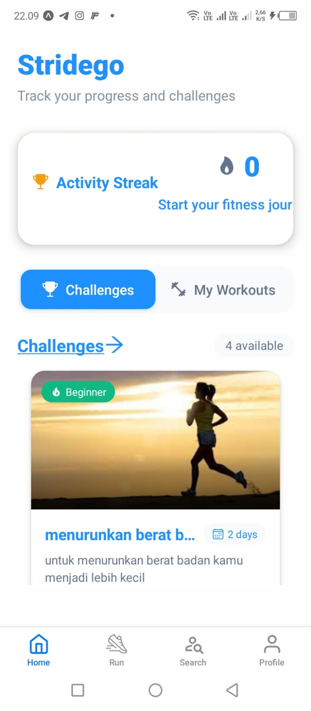
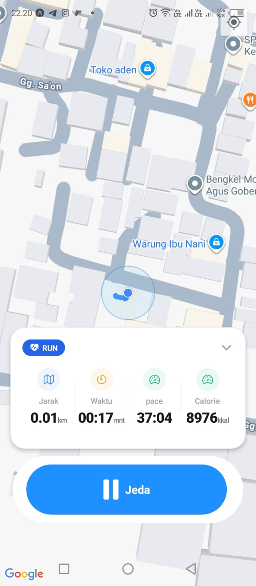

# StrideGo 🏃‍♂️


**StrideGo** is a comprehensive fitness tracking application designed to help users stay active, competitive, and organized. Built with React Native and Expo, StrideGo focuses on run tracking, community engagement through weekly challenges, and personalized workout planning.

> *Your stride, your goal, your journey.*

---

## 📱 Features

### 1. 📍 Real-time Run Tracking
Track your runs with precision. StrideGo monitors your route, distance, pace, and time in real-time using geolocation services.
- GPS Route Mapping
- Live Pace & Distance Calculation
- Run History & Stats

### 2. 🏆 Weekly Challenges
Stay motivated by competing in generated weekly challenges.
- Join global or friend-based leaderboards.
- Earn badges for completing distance or frequency goals.
- Push notifications for challenge updates.

### 3. 🏋️ Custom Workout Builder
Not just for running—plan your gym sessions or home workouts.
- Create custom routines (Sets, Reps, Weights).
- Save workout templates.
- Track progress over time.

---
## ERD


---

## 📸 Screenshots

|                 Home Screen                 |                         Run Tracking                         | Weekly Challenges | Create Workout |
|:-------------------------------------------:|:------------------------------------------------------------:|:---:|:---:|
|  |  |  |  |

---

## 🛠 Tech Stack

* **Framework:** [React Native](https://reactnative.dev/)
* **Platform:** [Expo](https://expo.dev/)
* **Navigation:** React Navigation (Stack & Tab)
* **Maps:** React Native Maps / Expo Location
* **State Management:** 
* **Storage:**  Supabase 
---

## 🚀 Getting Started

Follow these instructions to get a copy of the project up and running on your local machine.

### Prerequisites

* [Node.js](https://nodejs.org/) (LTS version recommended)
* [Expo Go](https://expo.dev/client) app installed on your iOS or Android device.

### Installation

1.  **Clone the repository**
    ```bash
    git clone [https://github.com/username/stridego.git](https://github.com/username/stridego.git)
    cd stridego
    ```

2.  **Install dependencies**
    ```bash
    npm install
    # or
    yarn install
    ```

3.  **Start the development server**
    ```bash
    npx expo start
    ```

4.  **Run on device**
   * Scan the QR code shown in the terminal using the **Expo Go** app (Android) or the Camera app (iOS).

---

